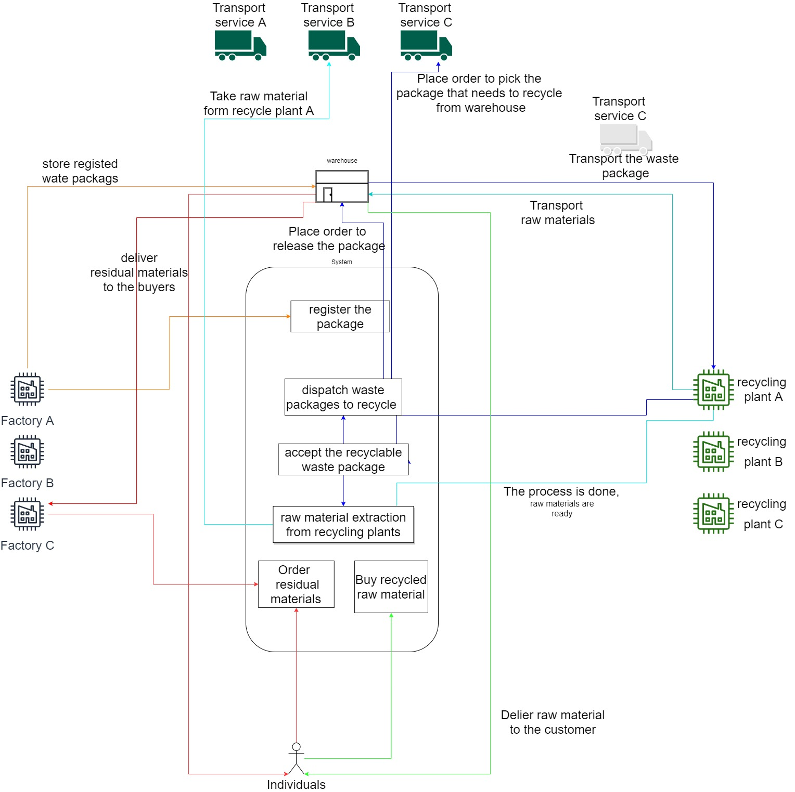

# GreenHouse-industrial-waste-management

3rd year undergraduate capstone project. Develop a web application to organize, and optimize the distribution of industrial waste or by-products from the suppliers (industries) to recycling plants, and other manufacturers.

## Features

- auth - auth0

- register/login industries
- register/login transport services
- register/login recycling plants
- register/login buyers

- register waste package to recycled
- information about extraction time and info
- store waste in the warehouse if recyclers are at max capacity

- extract raw mats from recycling plants

- order residual materials before recycling
- give delivery info

- buy recycled raw mats
- give delivery info

- distribute the waste to the recycling plants according to their capacity

## task list

- [x] design
  - [ ] design Architecture
  - [ ] design database
  - [ ] design ui with figma
- [ ] development
  - [ ] develop the data layer (prisma js)
    - [ ] task 1
    - [ ] task 2
    - [ ] task 3
  - [ ] develop the application layer (node.js + express.js)
    - [ ] task 1
    - [ ] task 2
    - [ ] task 3
  - [ ] develop the presentation layer / UI (react.js)
    - [ ] task 1
    - [ ] task 2
    - [ ] task 3
- [ ] setup environment
  - [ ] configuer cloud environment
  - [ ] setup domain
  - [ ] setup ssl

# High level system design

